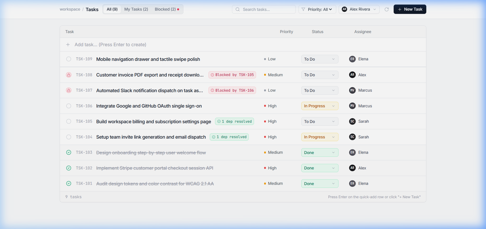
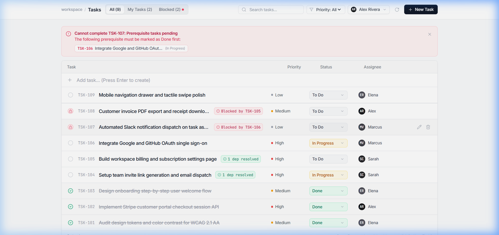
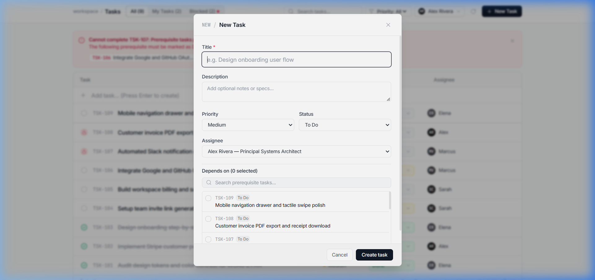
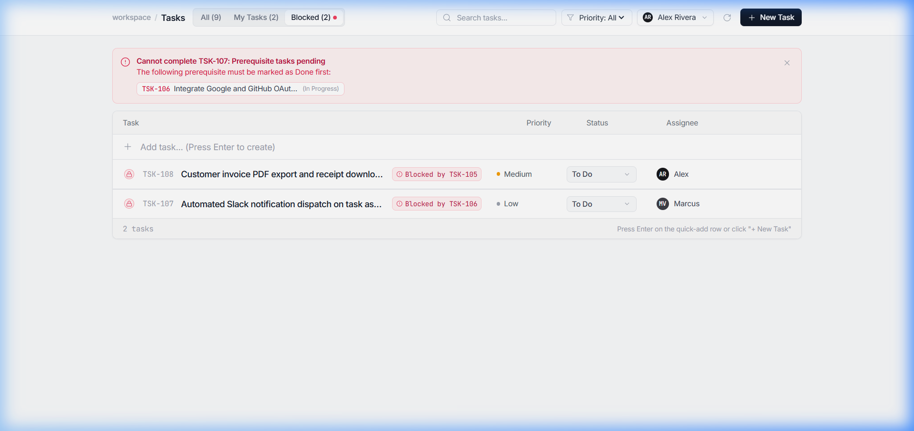

# Immverse_ai_task

# ⚡ Smart Task Manager with Dependency Engine

A clean, responsive task management application built with **Next.js 14**, **TypeScript**, and **Tailwind CSS**. Designed to handle real-world task dependencies, prevent circular dependency deadlocks, dynamically track blockers, and maintain data integrity.

Developed as part of the **Immverse AI Internship Technical Assessment**.

---

## 📸 Screenshots & Demo Walkthrough

### 1. Main Workspace & Task Table
View all tasks, assignees, priorities, and status indicators. Tasks with unmet prerequisites display a red blocker tag, while resolved dependencies are marked in green.



---

### 2. Dependency Blocker Alert & Prevention
Attempting to mark a blocked task as "Done" triggers an immediate inline blocker alert banner detailing the exact prerequisite tasks that must be finished first. Both client and server reject invalid state transitions.



---

### 3. Task Creation & Dependency Graph Linking
Create or edit tasks with custom priorities, assignees, and prerequisites. Cycle detection prevents tasks from depending on themselves or creating circular dependency chains.



---

### 4. Filtered Views & One-Click Navigation
Filter tasks by tab (`All`, `My Tasks`, or `Blocked`), search by title/description/assignee, or filter by priority. Clicking any `Blocked by TSK-XXX` badge instantly scrolls to and highlights the blocking task.



---

## ✨ Key Features

- **Directed Acyclic Graph (DAG) Engine**:
  - Tasks can declare upstream prerequisites.
  - Cycle detection using Depth-First Search (DFS) prevents circular deadlocks ($A \to B \to A$ or $A \to B \to C \to A$).
  - Self-dependencies ($A \to A$) are strictly blocked.

- **Dynamic Blocker Resolution**:
  - A task's blocked state is dynamically derived based on the live status of its upstream prerequisites.
  - If any prerequisite is not `Done`, the dependent task is automatically flagged as blocked with the blocker details.
  - Once all prerequisites reach `Done`, the dependent task unlocks automatically.

- **Strict State Machine Invariants**:
  - Tasks cannot be marked `Done` while any prerequisite remains unresolved.
  - Enforced both optimistically in the React UI and defensively in API route handlers (`HTTP 400 Bad Request` with itemized blockers).

- **Cascading Referential Integrity**:
  - Deleting an upstream task automatically cascades through all dependent tasks, purging the deleted ID from their prerequisite lists to prevent orphaned locks.

- **Fast, Tactile User Experience**:
  - Inline quick-add input (type title and press `Enter`).
  - Single-click status transitions and inline assignee reassignments.
  - Multi-user switcher simulating workspace collaboration between team members.
  - Full keyboard shortcuts (`Esc` to close modals, `Ctrl/Cmd + Enter` to save).

---

## 🛠️ Tech Stack

| Layer | Technology |
|---|---|
| **Framework** | [Next.js 14](https://nextjs.org/) (App Router) |
| **Language** | [TypeScript](https://www.typescriptlang.org/) (Strict mode) |
| **Styling** | [Tailwind CSS](https://tailwindcss.com/) |
| **Icons** | [Lucide React](https://lucide.dev/) |
| **State / Storage** | In-Memory Singleton Store with HMR survival |

---

## 📁 Project Structure

```text
immverse_ai/
├── package.json               # Root workspace scripts (dev, build, install)
├── screenshots/               # Application demo screenshots
│   ├── 01-dashboard.png
│   ├── 02-blocker-alert.png
│   ├── 03-new-task-modal.png
│   └── 04-blocked-filter.png
└── smart-task-manager/        # Next.js 14 Application
    ├── app/
    │   ├── api/
    │   │   ├── auth/login/    # Mock session authentication API
    │   │   ├── tasks/         # GET (filter/search), POST (create)
    │   │   │   └── [id]/      # GET, PATCH (update/guardrails), DELETE (cascade)
    │   │   └── users/         # GET, POST (team member registration)
    │   ├── globals.css        # Global CSS & typography
    │   ├── layout.tsx         # Root HTML shell & metadata
    │   └── page.tsx           # Main workspace UI, filters & state management
    ├── components/
    │   ├── BlockerAlertBanner.tsx  # Dynamic blocker remediation banner
    │   ├── EmptyState.tsx          # Clean empty state view
    │   ├── TaskModal.tsx           # Create / Edit slide-over sheet
    │   ├── TaskRow.tsx             # Interactive task row (desktop & mobile)
    │   ├── TaskTable.tsx           # Task table container & quick-entry row
    │   └── UserSwitcher.tsx        # Active user session switcher dropdown
    └── lib/
        ├── store.ts           # In-memory DAG engine, validation & seed data
        └── types.ts           # Shared TypeScript interfaces & types
```

---

## 🚀 Getting Started

### Prerequisites
- **Node.js** 18.17+ or 20+
- **npm** (comes with Node.js)

### Installation & Local Setup

1. **Clone the repository**:
   ```bash
   git clone https://github.com/jayramgit94/Immverse_ai_task.git
   cd Immverse_ai_task
   ```

2. **Install dependencies**:
   ```bash
   npm run install:all
   ```
   *(Or navigate into `cd smart-task-manager && npm install`)*

3. **Start the development server**:
   ```bash
   npm run dev
   ```

4. **Open in browser**:
   Navigate to [http://localhost:3000](http://localhost:3000)

5. **Build for production** (optional):
   ```bash
   npm run build
   npm run start
   ```

---

## 🔌 API Reference

### Tasks Endpoints

| Method | Endpoint | Description |
|---|---|---|
| `GET` | `/api/tasks` | Get all tasks. Supports `?status=`, `?priority=`, `?assignedUserId=`, `?search=`, and `?blockedOnly=true`. |
| `POST` | `/api/tasks` | Create a new task. Validates required fields, prerequisites existence, and blocker rules. |
| `GET` | `/api/tasks/:id` | Get details for a specific task along with enriched blocker data. |
| `PATCH` | `/api/tasks/:id` | Update task attributes. Validates DAG cycles and prevents setting `Done` if blocked. |
| `DELETE` | `/api/tasks/:id` | Delete a task and cascades cleanup across all dependent tasks. |

### Users & Session Endpoints

| Method | Endpoint | Description |
|---|---|---|
| `GET` | `/api/users` | List all team members in the workspace. |
| `POST` | `/api/users` | Register a new team member. |
| `POST` | `/api/auth/login` | Switch the active session user. |

---

## 💡 Engineering Highlights & Decisions

### 1. Dynamic Derived State vs. Static Flags
Instead of persisting an `isBlocked` boolean flag that could fall out of sync when prerequisites are modified, `isBlocked` and `blockingTasks` are computed dynamically at query time from the current graph state. This guarantees zero state drift and eliminates cache invalidation bugs.

### 2. DAG Cycle Detection with Depth-First Search
When updating dependencies for a task $T$, the engine runs a DFS traversal starting at the proposed dependencies. If any path leads back to $T$, a cycle is detected and the mutation is rejected before saving, preventing infinite deadlocks.

### 3. Cascading Referential Integrity
When a task is deleted, the store automatically scans all remaining tasks and filters out the deleted task's ID from their `dependencyIds` arrays. Downstream tasks are never permanently locked by non-existent task IDs.

---

## 👤 Author

- **Jayram**
- GitHub: [@jayramgit94](https://github.com/jayramgit94)
- Internship Candidate for **Immverse AI**
